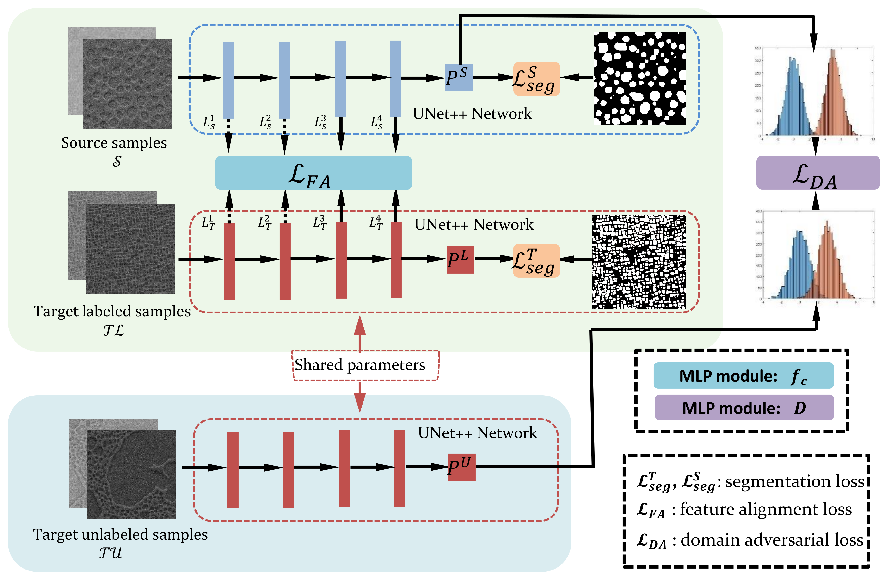

# FDA

This repository provides the official pytorch implementation of feature distribution alignment (FDA) for the microstructure recognition of nickel-based superalloys with different compositions and heat treatment procedures.

## Paper
##### Semi-Supervised Deep Transfer Learning for the Microstructure Recognition in the High-Throughput Characterization of Nickel-based Superalloys\url{https://doi.org/10.1016/j.matchar.2023.113094}

## Preparation
### Dataset
You can contact the author [Weifu Li] (liweifu@mail.hzau.edu.cn) to get the data.

### Data partitioning
cd preprocess

python train_val.py

### Train a source model
python tools/train_source.py

## Train the recognition model
### Trianing
python tools/train.py

### Testing
python tools/test.py

### Visuliztion
python tools/vis.py
